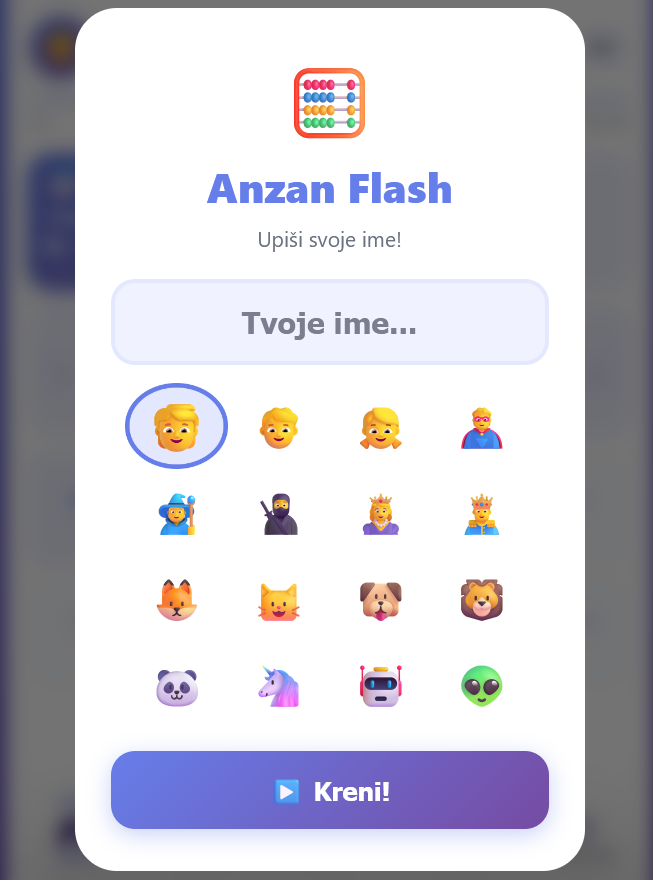
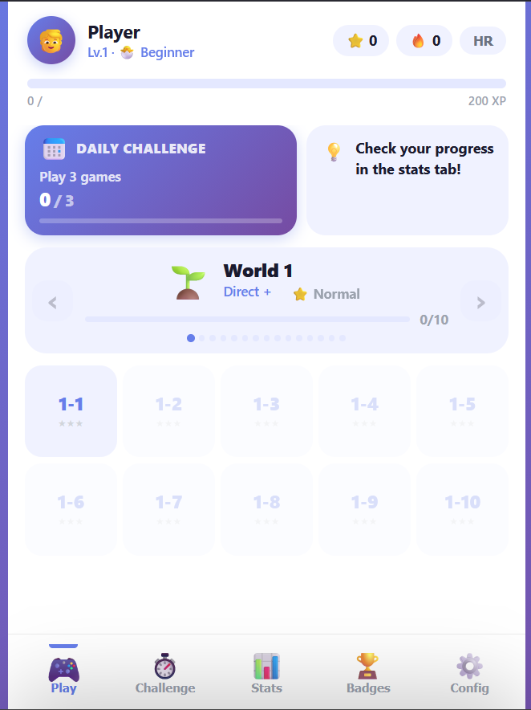
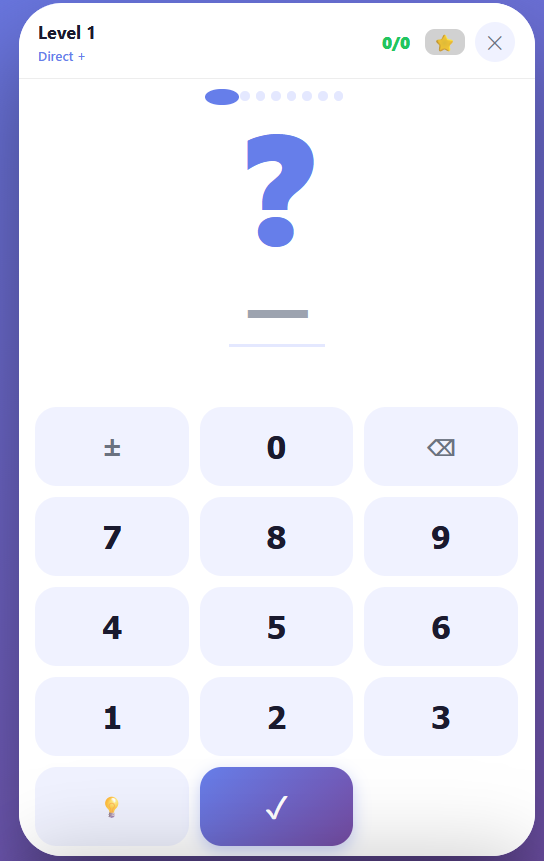
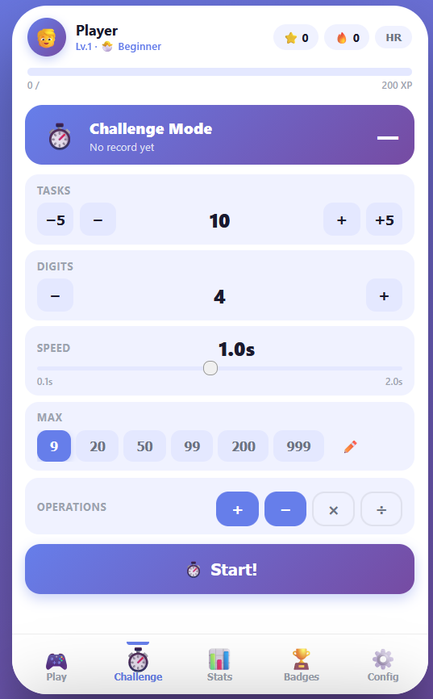
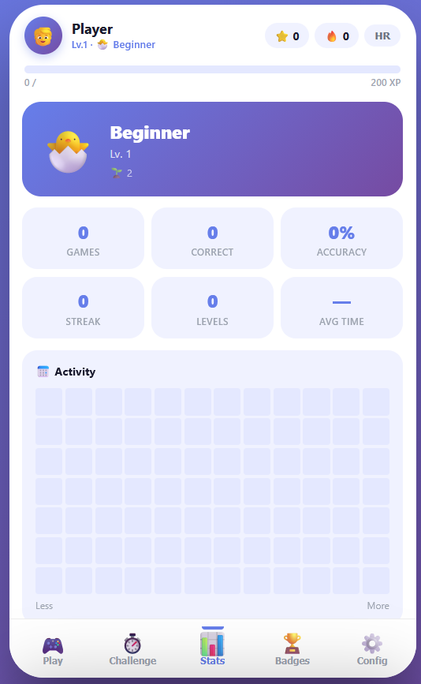
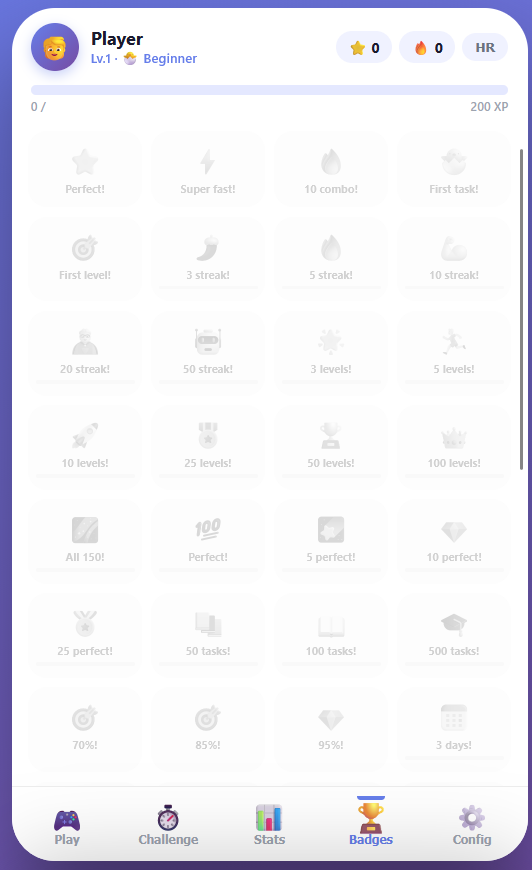
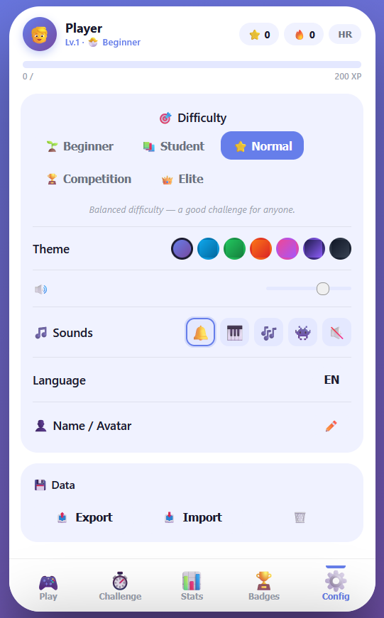

# 🧮 Anzan Flash

A mobile-first browser game for training **mental abacus (anzan)** — the Japanese technique of visualising a soroban in your mind to perform rapid mental arithmetic.

No install. No account. One HTML file.

---

## Screenshots

<p align="center">
  
  &nbsp;&nbsp;
  
  &nbsp;&nbsp;
  
</p>
<p align="center">
  <sub>Start screen &nbsp;·&nbsp; Play tab &nbsp;·&nbsp; Gameplay</sub>
</p>

<p align="center">
  
  &nbsp;&nbsp;
  
  &nbsp;&nbsp;
  
</p>
<p align="center">
  <sub>Challenge mode &nbsp;·&nbsp; Stats &nbsp;·&nbsp; Badges</sub>
</p>

<p align="center">
  
</p>
<p align="center">
  <sub>Config tab</sub>
</p>

---

## What is Anzan?

Anzan (暗算) is mental arithmetic performed by visualising an abacus. Practitioners learn to "see" a soroban in their mind and manipulate its beads mentally — allowing them to add, subtract, multiply and divide sequences of numbers at extraordinary speed. Students progress through grades, and the top competitors perform at world-championship level.

This app trains the core skill: recognising numbers shown rapidly in sequence and computing their result before they vanish.

---

## Features

- **150 levels** across 15 worlds, each introducing a new abacus technique
- **5 difficulty tiers** from Beginner to Elite (based on real competition standards)
- **Challenge mode** — custom head-to-head style sessions with PB tracking
- **Adaptive mode** — difficulty adjusts automatically based on your performance
- **Daily challenge** — goal scales with your player level
- **52 trophies** across 8 categories
- **18 player ranks** from 🐣 Beginner to 🧙 Anzan Sage
- **Mastery system** — Bronze / Silver / Gold / Diamond per level
- **5 sound themes** and 7 visual themes
- **Full Croatian / English** localisation
- **Export / Import** — portable save format with checksum validation
- No ads, no server, no dependencies beyond an optional Chart.js CDN for the stats graph

---

## Difficulty Tiers

Set in the **Config** tab. Applies to all 150 levels. Challenge mode and Adaptive mode use their own settings.

| Tier | Based on | Speed | Numbers | Max value | XP |
|------|----------|-------|---------|-----------|-----|
| 🌱 Beginner | Absolute newcomer | ×1.6 slower | −2 | ×0.5 | ×0.6 |
| 📚 Student | Active learner | ×1.2 slower | −1 | ×0.8 | ×0.8 |
| ⭐ Normal | Balanced default | ×1.0 | ±0 | ×1.0 | ×1.0 |
| 🏆 Competition | All-Japan Championship | ×0.55 faster | +2 | ×1.8 | ×1.5 |
| 👑 Elite | Guinness World Record territory | ×0.25 faster | +4 | ×3.0 | ×2.5 |

**Example — World 1, Level 1** (base: 2 numbers, 1750 ms each, max value 5):

| Tier | Numbers | Speed | Max |
|------|---------|-------|-----|
| 🌱 Beginner | 1 | 2800 ms | 3 |
| 📚 Student | 1 | 2100 ms | 4 |
| ⭐ Normal | 2 | 1750 ms | 5 |
| 🏆 Competition | 4 | 963 ms | 9 |
| 👑 Elite | 6 | 438 ms | 15 |

At World 15 Level 10 on Elite: 15 numbers at ~125 ms each — comparable to the Guinness World Record of 15 three-digit numbers in 1.61 seconds.

---

## The 15 Worlds

Each world focuses on a different abacus technique. Levels 5–10 introduce mixed practice drawing from earlier worlds.

| World | Icon | Technique | Description |
|-------|------|-----------|-------------|
| 1 | 🌱 | Direct + | Simple direct addition |
| 2 | 🌿 | Direct ± | Addition and subtraction |
| 3 | 📚 | Brothers + | "Brother numbers" complementing to 10 |
| 4 | 📖 | Brothers − | Brothers with subtraction |
| 5 | 💪 | Relatives + | "Relative numbers" complementing to 5 |
| 6 | 🔑 | Relatives − | Relatives with subtraction |
| 7 | 🏘️ | Neighbors + | Neighbor combinations |
| 8 | 🔢 | Neighbors − | Neighbors with subtraction |
| 9 | ➕ | Addition | Multi-digit addition |
| 10 | ➖ | Subtraction | Multi-digit subtraction |
| 11 | ✖️ | Multiplication | Mental multiplication |
| 12 | ➗ | Division | Mental division |
| 13 | ⭐ | Mixed | All operations combined |
| 14 | ⚡ | Speed + | High-speed addition sprint |
| 15 | 👑 | Master | All techniques at maximum difficulty |

Worlds unlock sequentially — complete the final level of a world to open the next.

---

## Mastery System

Every level earns a mastery rating based on accuracy and average response time per number.

| Mastery | Condition |
|---------|-----------|
| 💎 Diamond | 100% accuracy AND average response < 3 s |
| 🥇 Gold | 100% accuracy |
| 🥈 Silver | ≥ 80% accuracy |
| 🥉 Bronze | ≥ 60% accuracy |
| — | Below 60% |

---

## Rank System

Player rank is based on total player level (XP → level). XP required per level: `200 × 1.18^(level−1)`.

| Rank | Level range |
|------|-------------|
| 🐣 Beginner / Početnik | 1–2 |
| 🌱 Learner / Učenik | 3–4 |
| 📖 Apprentice / Pripravnik | 5–7 |
| ✏️ Student | 8–10 |
| 🔢 Counter / Brojač | 11–14 |
| 💡 Thinker / Mislioc | 15–19 |
| ⚡ Speedster / Munja | 20–24 |
| 🎯 Precise / Perfekcionist | 25–29 |
| 🏅 Competitor / Natjecatelj | 30–34 |
| 🔥 Hot Mind / Vatreni Um | 35–39 |
| 🧠 Sharp / Pametan | 40–44 |
| 🚀 Rocketeer / Astronaut | 45–49 |
| 💎 Diamond / Dijamant | 50–59 |
| 🏆 Champion / Prvak | 60–69 |
| 👑 Master / Majstor | 70–79 |
| 🌟 Grand Master / Velikan | 80–89 |
| 🌌 Legend / Legenda | 90–99 |
| 🧙 Anzan Sage / Anzan Mudrac | 100+ |

---

## Challenge Mode

Configure and run custom sessions:

| Parameter | Range | Default |
|-----------|-------|---------|
| Rounds | 1–200 | 10 |
| Numbers per round | 2–15 | 5 |
| Flash speed | 100–2000 ms | 1000 ms |
| Max number | 1–99999 | Auto |
| Operations | add / sub / mult / div | add |

**Auto-max**: changing the digit count automatically suggests a sensible max value (2–3 digits → 9, 4–5 → 50, 6–8 → 99, 9+ → 200). Can be overridden manually with the ✏️ button.

Personal bests are tracked per unique config (rounds × numbers × speed × maxNum × operations).

---

## Adaptive Mode

Unlocks at 100 levels completed. The game automatically adjusts digit count, speed, and max value based on your rolling accuracy — getting harder when you do well, easing off when you struggle. Unaffected by the difficulty setting.

---

## Stats & Progress

Tracked across all sessions:

- Total rounds played, correct answers, accuracy rate
- Best streak, total time, average response time per number
- Daily streak, daily game history (last 30 days as a heatmap)
- Levels completed, perfect levels (100% accuracy)
- Trophy counts, XP, player rank

---

## Daily Challenge

A fresh goal appears each day. Goal size: `3 + floor(playerLevel / 10)` rounds. Completing the daily goal counts toward your streak.

---

## Trophies (52 total)

| Category | Trophies |
|----------|----------|
| Repeatable in-game | ⭐ Perfect round, ⚡ Fast round, 🔥 10-combo |
| Milestones | First task, First level |
| Streaks | 3, 5, 10, 20, 50 correct in a row |
| Levels completed | 3, 5, 10, 25, 50, 100, all 150 |
| Perfect levels | 1, 5, 10, 25 |
| Rounds played | 50, 100, 500 |
| Accuracy | 70%, 85%, 95% (over 30+ rounds) |
| Daily streaks | 3, 7, 14, 30 days |
| Worlds completed | 3, 5, 10, all 15 |
| Mastery | First Bronze, Silver, Gold, Diamond |
| Speed | Average response time < 3 s |
| Marathon | 5 games in one day |
| Challenge | First run, 5 runs, 20 runs, new PB, 100% accuracy, finish < 30 s, finish < 15 s |
| Rank milestones | Reach level 15, 50, 70, 100 |

---

## Settings

**Visual themes (7):** Default · Ocean · Forest · Sunset · Candy · Space · Dark

**Sound themes (5):**
- 🔔 Classic — sine wave, gentle tone
- 🎹 Piano — triangle wave, resonant
- 🎶 Soft — quiet sine, low gain
- 👾 Retro — square wave, chiptune feel
- 🔇 Off — silent

**Difficulty:** 🌱 Beginner · 📚 Student · ⭐ Normal · 🏆 Competition · 👑 Elite

**Language:** Croatian (HR) · English (EN)

---

## Data & Privacy

All data is stored locally in the browser. Nothing is sent to any server.

| Key | Contents |
|-----|----------|
| `az2` | Full player save (JSON) |
| `az_lang` | Language preference |
| `az_t` | Visual theme |
| `az_v` | Volume |
| `az_st` | Sound theme |

---

## Export / Import

The export format is a base64-encoded, XOR-obfuscated JSON blob with a checksum. Import validates the checksum before applying. Use the Export / Import buttons in the Config tab to back up or transfer saves between devices.

---

## Keyboard Shortcuts

| Key | Action |
|-----|--------|
| `0`–`9` | Enter digit |
| `-` | Toggle negative sign |
| `Backspace` | Delete last digit |
| `Enter` | Submit answer / Continue |
| `Escape` | Exit game |

---

## Usage

1. Open `anzan_flash.html` in any modern browser — no server needed
2. Enter your name and choose an avatar
3. Complete the short tutorial
4. Set your preferred **difficulty** in the Config tab before starting
5. Work through the levels in order, or jump straight into Challenge mode

### Tips for progression

- **Beginner / Student** — focus on accuracy over speed; the game increases difficulty naturally as you level up
- **Normal** — the intended experience for someone learning actively
- **Competition** — suitable once you can reliably clear World 5–6 on Normal
- **Elite** — for experienced practitioners who want to benchmark against world-record standards

---

## Testing

```bash
# Unit tests — 69 tests, pure logic, no browser needed
node test_unit.js
node test_unit.js --verbose

# Integration tests — 21 tests, real Chromium via Playwright
pip install playwright
playwright install chromium
python3 test_integration.py
python3 test_integration.py -v
python3 test_integration.py -k challenge   # filter by name
```

---

## Technical Notes

- Single self-contained HTML file — ~134 KB, ~1363 lines
- No build step, no framework, no npm
- Vanilla JS (ES2020), CSS custom properties for theming
- Chart.js loaded from CDN for the stats graph — app works without it (graph hidden)
- `localStorage` for persistence; Export / Import for cross-device transfer
- Tested on Chrome, Firefox, Safari, and mobile browsers

---

## License

**CC BY-NC-ND 4.0** — Creative Commons Attribution-NonCommercial-NoDerivatives 4.0 International.

Free for personal and educational use. Commercial use or distribution of modified versions requires written permission from the author. See [LICENSE](LICENSE) for full terms.
